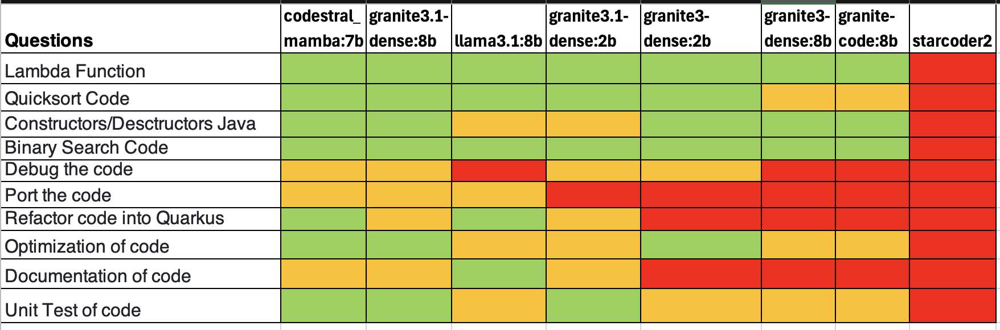

### Comparison table for different models ranked 1 (Best) -> 5 (Worst)

> [!NOTE]
> $${\color{green}Green}$$ indicates that the model succeeded in all three iterations. $${\color{Orange}Orange}$$ means it succeeded in at least one iteration but not in all three. $${\color{red}Red}$$ means it failed in all three iterations.

### Summary:

**Codestral-mamba:7b**
Best overall results. Accuracy is very good on 7 questions. ollama did not return response time, but the result generation or latency is the fastest in all scenarios. 

**granite3.1-dense:8b**
More accurate than granite3 models and more detailed than granite3.1-dense:2b. Context length 128k under continue.dev tends to stall after multiple prompts in the same context session. Reducing context length back to 4k speeds through all 10 prompts with higher accuracy than granite3 models.

**Llama3.1:8b**
Results are accurate but inconsistent, and often verbose with explanation. Reads the full code. Slowest response time of all models tested.

**granite3.1-dense:2b**
Better than granite3-dense:2b  Very Fast response. Less accurate than granite3.1-dense:8b

**Starcoder2:7b**
Unusable and unstable. Prints the question in the result before printing the answer. The printed answer is usually garbage or unusable.

---------------------------------------------------------------------------------------------------

No model is completely consistent. For granite, in a few cases, the result is better than codestral. But since the results are inconsistent, the overall performance is worse.
Comparisons are focused on accuracy, completeness of response, and consistency between iterations.

For more details please refer to [chat-results](https://github.com/IBM-OSS-Support/Continue.dev-Granite-manual-test-cases/tree/main/chat-results)
